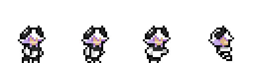

# Quarzite (OC) Skin Mod for Celeste

## Stats from [GameBanana](https://gamebanana.com/mods/486547)

*   **Downloads:** <!-- GB_DOWNLOADS --> 11.6k
*   **Views:** <!-- GB_VIEWS --> 19.8k
*   **Likes:** <!-- GB_LIKES --> 12

**Last checked:** <!-- LAST_UPDATED --> 2025-05-09 13:17:47 UTC

This mod replaces Madeline's sprites with my original character, Quarzite.

[Watch the Trailer!](https://youtu.be/cf8vszusN4w)

[Gameplay](https://youtu.be/dm_2ijtqysA)

## Features

*   Replaces player sprites with Quarzite.
*   Covers basic gameplay/campaign animations.
*   Includes custom idle animation(s).
*   Supports different hair colors based on dash count (via Skin Mod Helper config).
    *   0 Dash: Dark Grey (`#2E2E2E`)
    *   1 Dash: White (`#FFFFFF`)
    *   2 Dashes: Lilac (`#A86ACC`)
    *   *(Note: Hyperline length 7 used in previews)*

## Installation

1.  **Install Everest & Olympus:** Ensure you have [Everest](https://everestapi.github.io/) (the Celeste mod loader) and [Olympus](https://gamebanana.com/tools/6449) (the mod installer/manager) installed.
2.  **Install Dependencies:** Make sure you have the required helper mods installed via Olympus:
    *   **For basic use:** [Skin Mod Helper](https://gamebanana.com/mods/166543) by bigkahuna443.
    *   **For CelesteNet/SMH+ features:** [Skin Mod Helper (Plus)](https://gamebanana.com/mods/473796) by AAA1459. (Also requires [CelesteNet](https://gamebanana.com/mods/488960) if using online features).
3.  **Install though GameBanana (Recommended Method):**
    *   Go to the [**Quarzite Skin Mod GameBanana page**](https://gamebanana.com/mods/486547).
    *   Click the **"Olympus - Everest Installer"** button (1-Click Install) for the desired version (usually the latest SMH+ compatible one).
    *   Olympus should automatically handle the download and installation.
4.  **Manual Installation (Alternative):**
    *   Download the desired `.zip` file from the [GameBanana page](https://gamebanana.com/mods/486547) or the [GitHub Releases page](https://github.com/Microck/Celeste-QuarziteSkin/releases/tag/release).
    *   Extract the downloaded ZIP file.
    *   Place the resulting mod folder (the one containing `Graphics`, `Dialog`, etc.) inside your Celeste `Mods` directory.
5.  **Launch & Configure:** Launch Celeste via Everest. Enable the mod in the Mod Options menu if it's not already active. Configure hair colors and other settings via Skin Mod Helper's in-game options menu.

## Credits

*   **Microck:** Original character design and sprites.
*   **kuksa:** Porting to Skin Mod Helper Plus, CelesteNet compatibility, and config help. [Check out their profile!](https://gamebanana.com/members/2563726)
*   **bigkahuna443:** Creator of [Skin Mod Helper](https://gamebanana.com/mods/166543).
*   **AAA1459:** Creator of [Skin Mod Helper (Plus)](https://gamebanana.com/mods/473796).

## License

This work is licensed under the [Creative Commons Attribution-NonCommercial-NoDerivs 4.0 International License](./LICENSE).

